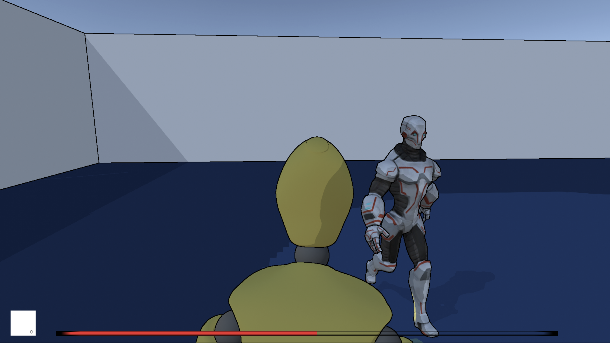

[](https://classroom.github.com/online_ide?assignment_repo_id=455530&assignment_repo_type=GroupAssignmentRepo)

**The University of Melbourne**

# COMP30019 – Graphics and Interaction - Be Human

## Table of contents

- [Team Members and Contributions](#team-members-and-Contributions)
- [Explanation of the game](#explanation-of-the-game)
- [How objects and entities were designed](#How-objects-and-entities-were-designed)
- [AI](#AI)
- [UI](#UI)
- [How the graphics pipeline and camera motion were handled](#How-the-graphics-pipeline-and-camera-motion-were-handled)
- [How the custom shaders work](#How-the-custom-shaders-work)
- [Procedural Generation](#Procedural-Generation)
- [Particle system](#Particle-system)
- [Querying and evaluation](#Querying-and-evaluation)
- [Technologies](#technologies)
- [References](#references)

## Team Members and Contributions

| Name         | Contributions                                                                             | State |
| :----------- | :---------------------------------------------------------------------------------------- | :---- |
| Nanyu Ding  | Game Logic, Death menu, Health bar                                                        | ✅    |
| Jarrod Iaria  | Shaders, Level Design, Pause menu, Particle system, Game trailer, Procedural Generation   | ✅    |
| Jiayi Wu     | Player Control, Camera, Start and Credit Menu, Font Style, Evaluation, Functional testing | ✅    |
| Tianjin Zhao | Enemy AI, Evaluation, Music                                                                   | ✅    |

## Explanation of the game

Our game is a 3rd-person escape game with a main level which consists several small rooms. The purpose of this game is to collect all the keys scattered in different rooms while avoiding direct confrontation with enemies. This game use full HD size to keep UI and scene in a well format.

**How to use it**

This game is expected to be played with keyboard and mouse. After launching the game, it will guide you through the background story. Once the user finish reading, click `next` to access the main menu, In the main menu, you can go back to review the story or quit the game. If you click `levels`, it will bring you to the level choose menu, and you can choose to go through the tutorial first or directly enter the main levels.

<p align="center">
  
</p>

When you get into a level, start to walk around by clicking `WASD` and find all the hidden keys (see left image). In addition, don't forget to collect the whistle which is used to lure the enemies to where you are by pressing `F`. This might help you to pass the levels a bit more easily. However, there are many enemies in each levels. Please try to avoid confrontation with enemies and be aware of your health bar. Once you've been seen by the enemy, your health will be deducted.

<p align="center">
  
   
   
</p>

When the health bar turns to empty, it will trigger the death menu to pop up, which show that you failed the game. By clicking `restart` you could retry this level again. If you've collected all the keys in the level, you need to find the last door key to pass the level. Once you've successfully passed the level, it will take you to the next level or bring you to the main menu if you've finished all the levels.

<p align="center">
  
   
</p>

You could press `esc` at any time to pause the game. In the pause menu, you can pick to `restart` or `resume` this level. If you don't want to continue playing , you can also click `quit` to return to the main level and quit the game.

<p align="center">
  
</p>

## How objects and entities were designed

**Model**

Both the game agent's model and NPC's model are downloaded from the asset store in Unity. To easily distinguish them and suit the background story we created for the game, we picked two different color robot model package.

<p align="center">
  
  
</p>

The whistle's model is a royalty free model from cgtrader.com(details in the reference). A metallic material is used to create a metallic effect on the whistle. Below is the model:
<p align="center">
  
</p>


**Props**

Only one usable prop by the player is implemented, but the implementation has left possibility for extension by creating a class for items.

The props' models have rotating and floating motions before being collected, in order to make them more noticable.

<p align="center">
  
</p>

- Whistle

  The whistle serves the purpose of attracting the closest enemy. It was designed to improve the playability of the game by adding more custom decision making, such as the timing and position to attract enemy with the whistle to make the game easier for the players themselves.

<p align="center">
  
</p>

## AI

**Movement**

The EnemyAi is very important part in our game, it determines the difficulty of the game. Therefore, EnemyAi needs to have multiple functions:

1. patrol on its route
2. with a cone-shaped detection range to detect the player
3. after the player is detected, the cone-shaped detection area makes a warning response
4. the Ai closest to the player try to find the player after the player used the whistle

Due to the classic stealth game design, the EnemyAi patrol on its route is necessary. At the same time, use a cone-shaped detection range to simulate a robot patrolling with a flashlight. The spotlight becomes turns to red colour to warn the player to enter the detection range.

<p align="center">
  
</p>

To increase the degree of the player's freedom, a whistle function was created, which is the special part of the game. The EnemyAi will be called by the whistle. Considering the coordination of the game, only the EnemyAi closest to the player will be attracted by the whistle. This design allows the player to decide when to use the whistle, this makes players feel more involved in the game.

<p align="center">
  
</p>

EnemyAi was controlled by two scripts: EnemyAi Patrolling and EnemyAi Fighting. The script EnemyAi Patrolling sets the route, color of spotlight and checks if the player is between the view angle; the script EnemyAi Fighting switches the state of Ai to fighting state, then the Ai closest to the player will automatically search for the player's location.

EnemyAi needs to have a cone-shaped detection range during the patrol. Within this range, it means that the player is discovered by EnemyAi.First of all, I need to determine whether the straight-line distance between the player and EnemyAi is less than the viewdistance which I set, if this is true, then I calculate the straight-line distance from the player to EnemyAi, and the angle formed by the player and the front of EnemyAi. Then move into the next conditional statement, if this angle is less than the half of viewangle which I set(angle of cone-shaped), means the player enters the detection range. The last conditional statement tests if the line of sight to the player is blocked by an obstacle, if it passes all three conditional statements, EnemyAi can see the player and return true.

```c#
// check if the Ai can see the player
bool CanSeePlayer() {
    if(Vector3.Distance(transform.position, player.position) < viewDistance) {
        Vector3 dirToPlayer = (player.position - transform.position).normalized;
        // the angle between the Ai forward direction and the direction to the player
        float angleBetweenEnemyAndPlayer = Vector3.Angle(transform.forward, dirToPlayer);
        if (angleBetweenEnemyAndPlayer < viewAngle / 2f) {
            // if the line of sight to the player is blocked by obstacle
            if(!Physics.Linecast (transform.position, player.position, viewMask)) {
                return true;
            }
        }
    }
    return false;
}

```

Before EnemyAi moves to the next target point, I choose to make EnemyAi face the target point first and then move to the next target point. Firstly, I pass a parameter named lookTarget which is the next target point. Then calculate the distance and angle between EnemyAi and the target point(rotate EnemyAi in the direction of the y-axis using trigonometry). While if the difference between the angle that EnemyAi is rotating and the angle that needs to be rotated is greater than 0.05(not using 0 because Euler angles might never reach the target angle), the EnemyAi will keep rotating towards the target angle. And then ant yield for one frame between each iteration of the while loop, so simply yield return null.

```c#
// set the Ai rotate to face the next waypoint before moving off
IEnumerator TurnToFace(Vector3 lookTarget) {
    // the Ai have on the y-axis to be facing the look target
    Vector3 dirToLookTarget = (lookTarget - transform.position).normalized;
    float targetAngle = 90 - Mathf.Atan2 (dirToLookTarget.z, dirToLookTarget.x) * Mathf.Rad2Deg;
    // while the delta angle is greater than 0.05 keep rotating towards the target angle
    while (Mathf.Abs(Mathf.DeltaAngle(transform.eulerAngles.y, targetAngle)) > 0.05f) {
        // make the Ai rotate towards this target angle at a time
        float angle = Mathf.MoveTowardsAngle (transform.eulerAngles.y, targetAngle, turnSpeed *Time.deltaTime);
        transform.eulerAngles = Vector3.up * angle;
        yield return null;
    }
}
```

This snippet of code is to keep EnemyAi to patrol on designated routes and waypoints. Firstly, I give each waypoint an index, while EnemyAi is patroling, EnemyAi will move to each waypoint order by their index. During the while loop, I add one conditional statement, if EnemyAi's current position reaches the next waypoint, and EnemyAi reaches the waypoint with maximum index, then set the target waypoint index to be 0, which means EnemyAi will go back to the start waypoint.

```c#
// make the enemy walk on setting path
IEnumerator FollowPath(Vector3[] waypoints) {
    transform.position = waypoints[0];
    int targetWaypointIndex = 1;
    Vector3 targetWaypoint = waypoints[targetWaypointIndex];
    transform.LookAt(targetWaypoint);
    while (patroling)
    {
        // move the Ai towards to the target point
        transform.position = Vector3.MoveTowards(transform.position, targetWaypoint, speed * Time.deltaTime);
        // if the transform dot position is equal to target position
        if (Vector3.Distance(transform.position, targetWaypoint) < offset) {
            targetWaypointIndex = (targetWaypointIndex + 1) % waypoints.Length;
            targetWaypoint = waypoints[targetWaypointIndex];
            yield return new WaitForSeconds (waitTime);
            yield return StartCoroutine(TurnToFace(targetWaypoint));
        }
        yield return null;
    }
}


```

## UI

**Font**

In this game, different fonts have been applied to distinguish the title, introductions and buttons. The fonts used in this game are all consistent with the story setting which picks a high tech modern world with robots. Meanwhile, the color of the fonts in the game is picked to introduce the high contrast against the background in order to make it easier to read. Apart from that, the color conbinations which may cause eye fatigue taught in lecture.

<p align="center">
  
  
  
</p>

**In game UI**

1. Health bar:

   The health bar is designed to be at the bottom of the UI to prevent it from blocking the players' vision, but still noticable at the same time.

2. Inventory:

   Inventory holds items and the number of items that you have collected. The image of the item shows on the bottom right of the UI, with a number indicating the amount of this item in possesion.

3. Keys in Possession:

   Shows the number of keys in possession on the bottom right corner.

4. Number of keys left:

   Indicates the number of keys needed to be collected in this level, displaying on the top of the screen.

5. **Pause menu**

   When pause menu appears, the background becomes much darker, which helps the user to better distinguish if they are still playing yet. The buttons in the pause menu are layered at the middle of the screen, so they can be cleared seen.

<p align="center">
  
  
</p>

**Sound**

To make the user more enjoy this game, background music has been added into this game. Also, a whisle sound has been added to indicate the use of item. Once the player use the whistle, the sound will give the user a reminder that the whistle has been used and the AI will come to the position where the sound is displayed. This helps the user more engaged into the game.

## How the graphics pipeline and camera motion were handled

**Graphics Pipeline and Optimisation**

Unity's Pro-Builder package was used to create the environments for the game. This allowed us to quickly prototype, test, and commit to level designs - and consequently meant that the games overall poly count was immensely low. This was essential in ensuring that the game had consistent and high performance even on older hardware.
Alongside this, we were also able to optimise the render pipeline in every shader by using Unity's low expense internal functions (such as using the in-built function for getting a vertex's world position) wherever possible, keeping the vertex processing LOD as low as possible in every instance, and only ever using normalisation functions where absolutely necessary.

The materials used throughout the project were also just single colours and texture-less, meaning we did not need to worry about texture quality affecting performance. However, we did make sure to lower the lightmap resolutions across the project should we have decided to bake any lightmaps at any point in development. After doing so whilst testing lighting settings, we opted to keep the lighting quality low as baking global illumination into the lightmaps turned out to be a long process that introduced lighting bugs due to some issues with how Pro-Builder generates UV's.

The most strenous task performed by the GPU was generating the Perlin Noise. In my original implementation of Perlin Noise used to create clouds, the noise was to be generated within the skybox shader on a per-frame basis in order to prevent repetition in the clouds. This proved to be incredibly GPU intensive and difficult to implement, so it was decided that the Perlin Noise generation would be seperated from the skybox shader and become its own shader that would be used for a noise material that could then be baked into a texture on start. This significantly reduced GPU usage.

**Camera motion**

The camera used in the game takes the 3rd person point of view placed at top back of the robot. By moving mouse up, down, left and right, the player can observe the surrounding environment and the status of enemies. Meanwhile, the movement of the robot is linked with the camera such that:

- The camera's view always aligns with the direction of the robot
- The position of the camera is relatively fixed at the robot's top back
- While the player controls the movement of the robot, the camera will follow the robot
- Camera rotation will drive the robot to turn around

By taking this approach, it is considered as the most intuitive control for both the robot and the camera.

In addition, the camera would move towards the robot a bit when the robot stands too close to a wall or at a corner to avoid camera collision with other objects in the environment.

<p align="center">
  
</p>

## How the custom shaders work

A number of shaders were created for the game, first I created Diffuse, Reflective, and Refractive materials to get to familiar with the HLSL language, which allowed me to then create a basic Cell shader and later an Emissive shader that utilises the Fresnel effect.
However, it is the Cell-Shader and Edge Detection shaders I am submitting for marking. Additionally, the Procedural Skybox shader is also being submitted, but to be marked as the games procedurally generated component.

Shader Locations within the Project Files:

Assets/Shaders/Cel_Shader

Assets/Shaders/Edge Detection

**Cel Shader Explanation**

The cell shader is just a simple variation on a diffuse shader that’s built on Unity’s Standard Surface Shader – which allows access to built in variables for factoring in different lights from the scene. We’re simply getting the dot product of the normal and the direction of the light, and then checking it it’s greater than 0. If it is, we make the dot product equal to 1, otherwise it’s equal to 0. Now when we use this value in calculating the diffuse component of the material, an area on the surface can only either be fully lit or fully in shadow. This creates that hard shadow across a surface that cell shading is known for.
The diffuse component otherwise works as normal, we multiply the dot product by the attenuation of the light (Unity has a built-in shader variable for this). We’ll call this value “diffuse”. We then take “diffuse” and multiply it by the colour of the light (or multiple lights), and then again by the scene’s ambient light – giving us the total diffuse component and creating the cell shaded effect.
However, this method creates some noticeable aliasing on larger surfaces.

<p align="center">
  
</p>

The solution to this is quite simple. You can multiply the fwidth of the diffuse component by a float, to get a value which we can call anything (in this case “delta”). The fwidth is the sum of the absolute value of two derivatives. A smooth-step function can be done between the diffuse component and delta values, which will perform a smooth interpolation between them and return a new value called “diffuse smooth”. If we then use “diffuse smooth” instead of “diffuse” in getting the diffuse component we’ll have anti-aliasing for our lights.

<p align="center">
  
</p>

**Edge Detection Shader Explanation**

The edge detection shader is a post-processing shader, so I’m using Unity’s “Unlit Shader” as the basis since we don’t need any lighting in this shader. For this shader I needed the vertex position, UV coordinates and a depth map to be passed through to the vertex shader. I’ve set up a function called “Grab Pixel Value” (as laid out in the tutorial I was following) which returns a depth texture and depth normal from the camera. Unity has a built-in shader function for this: ‘DecodeDepthNormal’. The function then returns a colour that is the combination of the normal and depth values.

\*Note: Edge detection can create artifacts that appear as black dots or noise. Within this function I performed a logarithm on the depth values, which reduces artifacts. The method comes from a blog post by William Chyr.

In the fragment shader we call the Grab Pixel Value function and parse through the UV map, and name the returned colour “Or Value”. We’re going to compare this colour at each pixel with the colour of the pixels surrounding it – and if the colour is similar that we can conclude that the pixel is not an edge, otherwise it is. If the pixel is an edge, we’re going to use a colour set in the properties panel instead of the material colour for that pixel.

An array of eight float2 (2D Vectors) is being used to get the positions of the surrounding pixels. When doing the comparison between a pixel and those surrounding it, the surrounding pixel vectors need to be multiplied by the Texel size of the main texture (which is actually the screen, because this is a post-process shader attached to the camera). This ensures that if the screen size or resolution changes, we’re still sampling the correct pixel position.

We need to get a value for the difference between the sampled pixels value, and the ‘or value’. If we subtract the sampled pixels value from the or ‘value’, the result is the difference. If we perform a step function using that difference value and a threshold value (set in the shaders properties menu), and then use the value that returns to interpolate between the edge colour we want to use and the material colour, we end up with the edge detection effect.

## Procedural Generation

**Procedural Skybox**

The procedural skybox consists of three major steps:

1. Unwrapping the Skybox UV and applying a 2D texture.
2. Generating layered Perlin Noise
3. Baking the noise into a Texture for use in the Skybox
   This is all done in three scripts, a shader for creating the Perlin noise, a C# script for baking the noise into a texture, and a shader for creating the skybox.

**UV’s**
Filename: Procedural Skybox

Location: Assets/Shaders/Procedural Skybox

Attempting to apply a 2D texture to a skybox causes the texture to stretch towards the top and sides of the UV. Adjusting the texture coordinates fixes this issue. To start, the world position needs to be normalised, which will give us a sphere to apply the texture to. To eliminate stretching near the top of the sphere, you can get the arcsine of Y coordinate of the world position and divide it by half of Pi. For the X and Z coordinates, you can get the arctangent squared and divide it by tau – this will remove any stretching around the sides of the sphere.
At this point, I’m also creating two colours accessible through the properties panel and interpolating between them to get a gradient for the skybox.
We also need a secondary UV space that lays flat against the sky that can be used for the clouds. This is quite simple, you just take divide the X and Z coordinates of the world position and divide it by the Y coordinate.

From this point onwards, the bulk of the shader relates to generating layered Perlin Noise to use in creating the procedurally generated clouds. The process of generating Perlin Noise involves generating random gradient vectors and offsets, grabbing the dot products of these values and then interpolating between them. For my implementation, I followed Ronja’s Tutorials approach of creating white noise to derive value noise, and later the Perlin Noise.

**White Noise**
Filename: Perlin Noise

Location: Assets/Shaders/PerlinNoise

For creating white noise, we use a basic function that takes a 3D vector and derives a random scalar value between 0 and 1, which is then converted into a 1D value by taking the dot product of the random scalar value with another 3D vector. This result then needs to be scaled down into a lower value by using only the fractional part. Thus far, the noise effect works but contains noticeable “bands” in the noise, which can be removed by multiplying the 1D vector by any random high number (e.g. 145508). This can cause artifacts, but because the noise will only be seen from a distance, and we’re later going to be interpolating the noise during the creation of gradient noise, this is a non-issue.

```c#
float rand(float3 vec){
    float random = dot(vec, float3(12.9898, 78.233, 37.719));
    random = frac(random * 143758.5453);
    return random;
}

```

If we use this noise as is, when we move the camera the changes in the noise are too pronounced and creating a nauseating effect. This is solved by dividing the space into “cells” and using the same random value for every point in that cell.

**Value Noise**
Now that we have white noise, we can create value noise, which changes far more gradually and with smoother gradations than white noise. The process for doing this is straightforward, all it takes it to interpolate between the centre of each cell. If we ceil the value we’re using in the white noise generation, we can get the position of the cell we want to interpolate to, and if we floor the value, we get the position of the cell before the one we’re currently in. Interpolating between the previous and next cells gives us smoothed value noise. Additionally, there are also some “easing functions” which ease the transition in and out of the cell and make the value noise smoother.

**Perlin Noise + Layering**
Perlin Noise can easily be generated from the value noise by using the same general principle of interpolating between cells. Rather than using the cells though, we’ll essentially interpolate between each quadrant of a 2x2 matrix both on the X and Y axes. Furthermore, more detailed noise can be derived by sampling the noise several times and layering it over itself.

<p align="center">
  
  
  
</p>

**Using the Noise in the Skybox**
To be able to use the noise in the skybox, I’ve created three materials that use the Perlin noise shader each with different settings – one to be used as the base noise, a second layer of noise, and then a third to distort the base noise with.

```c#
// moving clouds
                float baseNoise = tex2D(_BaseNoise, ((skyUV - _Time.x) * _BaseNoiseScale)).x;
                float firstNoise = tex2D(_Distort, ((skyUV + baseNoise)- (_Time.x * 0.2)) * _DistortScale);
                float secondNoise = tex2D(_SecondNoise, ((skyUV + firstNoise ) -  (_Time.x * 0.4)) * _SecNoiseScale);

```

I’m using a simple C# script that bakes the material into a texture that can be utilised in the skybox shader. Creating the clouds is done by layering each noise texture on top of each other and then moving them over the X axis. Each time the scene is started, new noise is generated.

Filename: ShaderBakeToTexture

Location: Assets/Shaders/ShaderBakeToTexture

```c#
       //render the material to a temporary rendertexture
        RenderTexture renderTexture = RenderTexture.GetTemporary(Resolution.x, Resolution.y);
        Graphics.Blit(null, renderTexture, ImageMaterial);

        //transfer image from rendertexture to texture
        Texture2D texture = new Texture2D(Resolution.x, Resolution.y);
        RenderTexture.active = renderTexture;
        texture.ReadPixels(new Rect(Vector2.zero, Resolution), 0, 0);

        byte[] png = texture.EncodeToPNG();
        File.WriteAllBytes(FilePath, png);
        AssetDatabase.Refresh();
```
NOTE: The ShaderBakeToTexture script uses a unity editor namespace and CANNOT be used when building the game. The script needs to be removed from the scene before building the game as a .exe, otherwise it will throw an error.


## Particle system

The particle system was added as a way of making the game's key object more noticeable to the player.
It works by generating particles in a ring shape and adjusting the size and colour of the particles of it's lifetime, creating a spinning ring of particles with a noticeable falloff at its tail. I'm also using the "noise" property to generate a noise texture that can be used to modulate the shape of the ring slightly and attaching the particle effect to the prefab for the key, so it appears in every instance of thekey.

<p align="center">
  
</p>

## Querying and evaluation

**Participants demographics**

In total, twelve volunteers participated in date collections for the user evaluation. The gender ratio of the participants are relatively even. Five of them (41.7%) are identified as female and others (58.3%) are male. Our participants are all around 20-22 years old, which is the target group of this game. In addition FPS (First-person shooter), RPG (Role play game) and MOBA (Multiplayer online battle ) are three major types of game our participants would normally play in daily time.

<p align="center">
  
  
</p>

**Quering techniques and Observational Method**

Since most of the volunteers participated online, we decided to use picked post-task walkthrough as our observational method. Compared with think aloud and cooperative evaluation, the participants would be more focused on the game content and not be interrupted. Before the evaulation part, we created a user evaluation survey with questions, which cover many aspects of the game.

The testing process is as followed:

- Send the copy of our game to the participants.
- For three participants meet face to face: watch them play the game.
- After they finish the game, hand out the user evaluation survey (made in Google Form).
- For three participants meet face to face: do an interview after they finish the survey.
- Once they submit the survey, all the date would be uploaded into shared Google Form directly.

Data of the User Evaluation Survey can be found in : UserEvaluationSurvey/User_Evaluation_Survey.csv

**Feedback**

Most of the participants mentioned one important point that the field of view is too small, they couldn't see if an enemey is close to them or not. Also, the position of the camera is too close to the player, which maked some of them feel dizzy while playing.

<p align="center">
  
</p>

Through the interview with the three participants, we noticed that the pop up messages in the tutorial level only display at certain position and disappear too fast. Meanwhile, pause menu and health bar doesn't work. Althrough we do receive a good feedback about the item collection part, the prop (whistle) made players very confused while playing because the tutorial level didn't include an brief introduction to this. And the participants had no idea about how many keys they need to collect to pass the levels.

<p align="center">
  
</p>

**Improvements based on evaluation**

| Problem                                                                        | Solution                                             | State |
| :----------------------------------------------------------------------------- | :--------------------------------------------------- | :---- |
| The camera is too close to the player                                          | Increase the field of view of camera                 | ✅    |
| Cursor disappear                                                               | Add cursor image to project setting                  | ✅    |
| Text is hard to recognize in main level                                        | Change text color and size                           | ✅    |
| The number of keys needs to be collected is not clear                          | Show information about keys on the UI                | ✅    |
| Don't have a bgm                                                               | add the background audio with player                 | ✅    |
| When the robot falling down, the death menu doesn't appear                     | Add invisible wall to prevent the robot falling down | ✅    |
| Gravity doesn't works well for falling down                                    | Reduce the player's gravity                          | ✅    |
| Don't know how to use the whistle                                              | Add introduction into tutorial level                 | ✅    |
| Text in tutorial level disappears too fast                                     | Pause time when the text appears                     | ✅    |
| Health bar in tutorial level doesn't change                                    | Has fixed the health bar                             | ✅    |
| The tutorial doesn't have a pause menu                                         | Pause menu added                                     | ✅    |
| The walls won't block the detection light from going through to the other side | add the obstacles layer for environment              | ✅    |
| Collision of the AI does not work                                              | the nav mesh agent need to bake the map before       | ✅    |
| Enemy and Scene lights pass through geometry                                   | Changed shadow settings for the lights to "hard"     | ✅    |
| Level too small and difficult to manoeuvre in                                  | Increased level and room sizes                       | ✅    |
| Level areas are too basic and provide little challenge                         | Made obstacle layouts denser, added new AI paths     | ✅    |

## Technologies

Project is created with:

- Unity 2021.1.13f1
- Ipsum version: 2.33
- Ament library version: 999

## References

The following assets used in our games are not ours.

**Models**

Player: Banana Man, Unity Asset Store

Enemy AI: Cyber Soldier, Unity Asset Store

Whistle: https://www.cgtrader.com/free-3d-print-models/hobby-diy/hand-tools/the-whistle

**UI**

Background: https://wall.alphacoders.com/big.php?i=1053223

Text Font: https://www.fontspace.com/aquire-font-f43735, https://www.fontspace.com/giants-italic-font-f68978, and https://www.fontspace.com/homme-font-f69120

Cursor: https://custom-cursor.com/en/collection/minimal-style/minimal-donut

**Sound**

BGM: https://www.apmmusic.com/albums/KPMT-0011/KPM_KPMT_0011_00101
Whistle sound effect: https://mixkit.co/free-sound-effects/whistle/

**Shader**

**Cel References**
https://danielilett.com/2019-06-08-tut2-2-cel-shading/
https://halisavakis.com/my-take-on-shaders-cel-shading/
https://www.ronja-tutorials.com/post/031-single-step-toon/

**Edge References**
https://medium.com/geekculture/shader-journey-3-basic-post-processing-effects-e9feb900ceff
https://williamchyr.com/unity-shaders-depth-and-normal-textures-part-3/
https://williamchyr.com/development-update-edge-detection-render-textures/
http://halisavakis.com/my-take-on-shaders-introduction-to-image-effects/

**General References**
https://docs.unity3d.com/Manual/SL-SurfaceShaders.html
https://www.youtube.com/watch?v=9WW5-0N1DsI&t=11115s
https://www.youtube.com/watch?v=kfM-yu0iQBk&t=7042s
